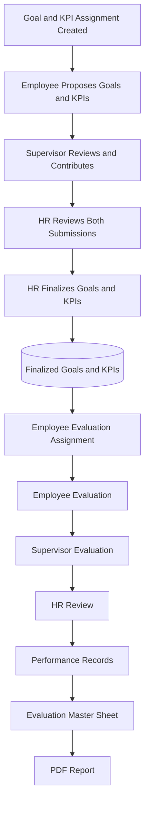
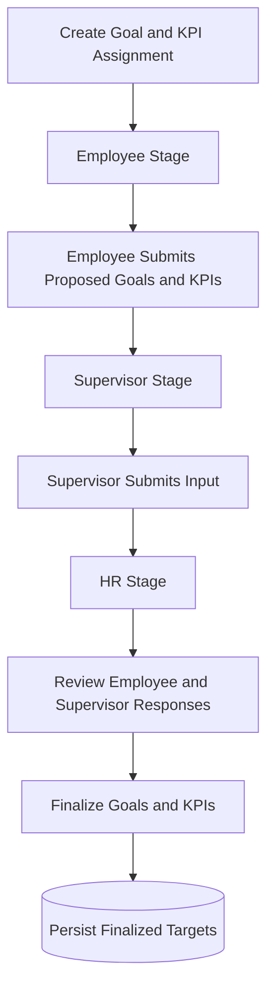
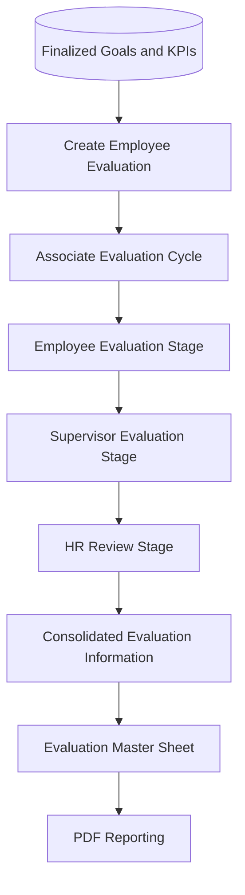
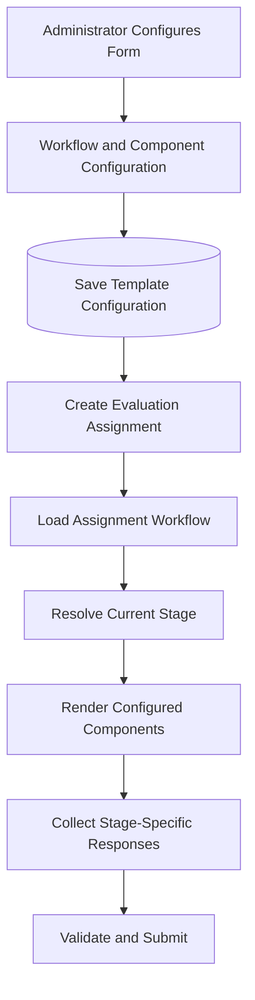
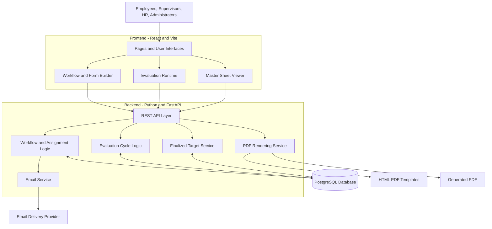
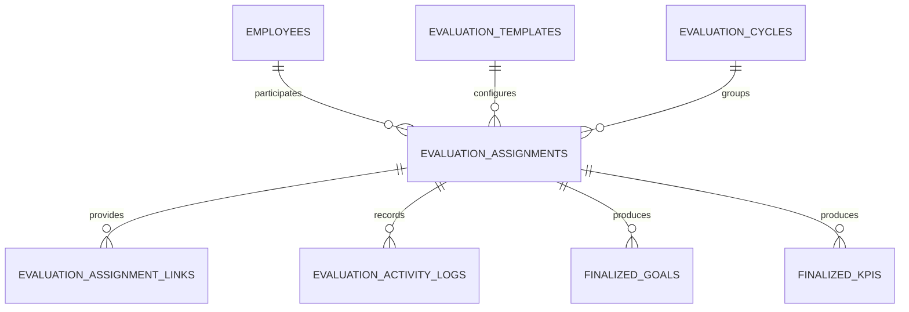
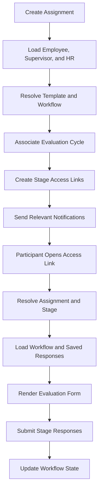
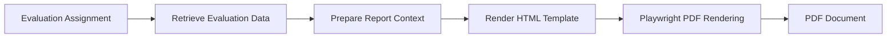
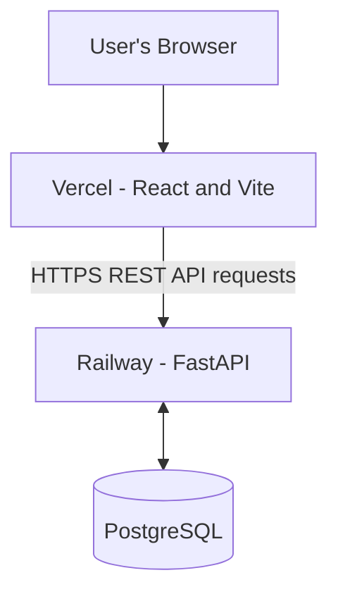

# FlowPilot — Performance Review Workflow Automation Platform

FlowPilot is a full-stack performance management and workflow automation platform that digitizes the employee performance review lifecycle. It connects goal and KPI setting, multi-stage evaluations, HR finalization, monthly performance tracking, automated notifications, and reporting in a centralized application.

Built with **React, FastAPI, and PostgreSQL**, FlowPilot combines configurable evaluation forms with structured workflow orchestration and cycle-aware performance data. The platform is designed to reduce manual coordination, improve consistency across review stages, and provide a consolidated view of employee performance.

## Table of Contents

- [Project Overview](#project-overview)
- [Core Features](#core-features)
- [End-to-End Business Workflow](#end-to-end-business-workflow)
- [Goal and KPI Setting](#goal-and-kpi-setting)
- [Employee Evaluation](#employee-evaluation)
- [Quarterly Evaluation Cycles](#quarterly-evaluation-cycles)
- [Configurable Form Builder](#configurable-form-builder)
- [System Architecture](#system-architecture)
- [Data Model](#data-model)
- [Evaluation Assignment and Access](#evaluation-assignment-and-access)
- [Master Sheets and PDF Reporting](#master-sheets-and-pdf-reporting)
- [Email Notifications](#email-notifications)
- [API Architecture](#api-architecture)
- [Technology Stack](#technology-stack)
- [Repository Structure](#repository-structure)
- [Deployment](#deployment)
- [Engineering Highlights](#engineering-highlights)
- [My Contributions](#my-contributions)

---

## Project Overview

### The Problem

Traditional performance review processes often rely on spreadsheets, email threads, manually maintained documents, and disconnected forms. These approaches can make it difficult to coordinate employees, supervisors, and HR, maintain consistent evaluation records, and track progress against agreed performance targets.

### The Solution

FlowPilot connects the performance review lifecycle through configurable workflows, centralized data storage, role-specific interfaces, automated notifications, and consolidated reporting.

The platform supports two connected business workflows:

1. **Goal and KPI Setting:** Employees propose goals and KPIs, supervisors provide their input, and HR reviews and finalizes the agreed targets.
2. **Employee Evaluation:** Finalized goals and KPIs are carried into the evaluation process, where employees and supervisors record performance information and HR reviews the results.

The two workflows remain distinct while sharing finalized performance targets.

## Core Features

- **Multi-stage workflow automation:** Structured Employee, Supervisor, and HR stages.
- **Configurable evaluation forms:** Reusable components driven by saved workflow configuration.
- **Goal and KPI management:** Separate employee and supervisor submissions followed by HR finalization.
- **Cross-workflow data integration:** Finalized goals and KPIs are reused in subsequent Employee Evaluations.
- **Quarterly evaluation cycles:** Assignments remain associated with their relevant review periods.
- **Monthly performance tracking:** Progress is recorded against finalized quarterly targets.
- **Role-specific interfaces:** Forms and responses are organized around the current workflow stage.
- **Stage-specific access links:** Participants access the relevant evaluation stage.
- **Automated email notifications:** Workflow-specific communication directs participants to the appropriate evaluation.
- **Evaluation Master Sheets:** Consolidated performance information for review and reporting.
- **PDF generation:** Structured evaluation data is rendered into downloadable reports.

---

## End-to-End Business Workflow

The following diagram illustrates how Goal and KPI Setting feeds into Employee Evaluation.



The finalized targets produced by the first workflow provide the foundation for the subsequent evaluation process.

---

## Goal and KPI Setting

The Goal and KPI Setting workflow collects proposed performance targets from employees and supervisors before HR finalizes the agreed goals and KPIs.



### Employee Responsibilities

- Propose goals and KPIs.
- Complete the employee-stage form.
- Submit responses for supervisor review.

### Supervisor Responsibilities

- Provide independent input on goals and KPIs.
- Complete the supervisor-stage form.
- Submit responses for HR review.

### HR Responsibilities

- Review employee and supervisor submissions.
- Finalize the agreed goals and KPIs.
- Complete the HR stage of the workflow.

Finalized targets are stored as structured records and can subsequently be retrieved by the Employee Evaluation workflow.

---

## Employee Evaluation

Employee Evaluation is a separate workflow associated with an evaluation cycle. It uses finalized goals and KPIs from the Goal and KPI Setting workflow and collects performance information through role-specific stages.



Depending on the configured form, evaluation components can support goal progress, self-ratings, supervisor ratings, KPI results, and other performance review information.

The workflow maintains the distinction between employee, supervisor, and HR responses.

---

## Quarterly Evaluation Cycles

FlowPilot organizes performance evaluations around quarterly cycles.

| Quarter | Calendar months |
|---|---|
| Q1 | January – March |
| Q2 | April – June |
| Q3 | July – September |
| Q4 | October – December |

Each evaluation assignment can retain its associated evaluation cycle, allowing historical evaluations to remain connected to the appropriate review period.

The application uses cycle information to determine the displayed monthly tracking period. For example, a Q4 evaluation can use October, November, and December for monthly tracking when a cycle begins partway through September and the partial starting month is excluded.

---

## Configurable Form Builder

FlowPilot uses a configurable workflow and form-rendering architecture. Instead of implementing every evaluation form as an independent hard-coded page, the platform stores workflow configuration as structured JSON and uses that configuration to render the relevant components.



This architecture supports reusable components and role-specific form rendering while keeping the configured workflow structure separate from the runtime interface.

---

## System Architecture

FlowPilot uses a React frontend, a FastAPI backend, and a PostgreSQL database. Backend routers expose the application's APIs, while service modules handle specific business operations and HTML templates support PDF report generation.



### Architectural Responsibilities

**Frontend**

- Displays assignment management and evaluation interfaces.
- Provides configurable form-building interfaces.
- Renders forms according to workflow configuration and stage.
- Presents consolidated Master Sheet information.

**Backend**

- Exposes REST APIs.
- Manages evaluation assignments and workflow transitions.
- Retrieves and stores stage-specific responses.
- Associates assignments with evaluation cycles.
- Processes finalized goals and KPIs.
- Sends workflow email notifications.
- Generates PDF reports.

**Database**

- Persists employee records, templates, assignments, evaluation cycles, responses, and finalized targets.

---

## Data Model

PostgreSQL provides persistent storage for the platform's core workflow and evaluation data.

### Core Entities

| Entity | Responsibility |
|---|---|
| `employees` | Stores employee and workflow participant records. |
| `evaluation_templates` | Stores reusable evaluation form and workflow configurations. |
| `evaluation_assignments` | Stores assignments, workflow snapshots, status, and cycle associations. |
| `evaluation_assignment_links` | Stores stage-specific access links. |
| `evaluation_cycles` | Defines quarterly evaluation periods. |
| `evaluation_preview_responses` | Stores evaluation preview data. |
| `evaluation_activity_logs` | Records workflow activity. |
| `finalized_goals` | Stores finalized goal records. |
| `finalized_kpis` | Stores finalized KPI records. |

### Entity Relationship Diagram



This is a conceptual relationship diagram. Exact foreign-key constraints and cardinalities depend on the implemented database models.

---

## Evaluation Assignment and Access

An evaluation assignment connects the relevant participants, template, workflow, and evaluation cycle. Stage-specific links allow participants to open the evaluation associated with their stage.



The backend coordinates assignment creation, stage-specific access, response persistence, and workflow progression.

---

## Master Sheets and PDF Reporting

Evaluation Master Sheets provide a consolidated view of performance information for HR and review purposes.

Depending on the assignment and available data, the Master Sheet can include:

- Employee and supervisor details.
- Department and review cycle.
- Finalized goals and KPIs.
- Employee evaluation responses.
- Supervisor evaluation responses.
- HR responses.
- Monthly goal progress.
- KPI review and planning information.
- Final agreed KPI targets.

### PDF Generation Pipeline



The backend prepares structured evaluation data, renders the HTML report template, and uses Playwright to generate the PDF document.

---

## Email Notifications

FlowPilot integrates email notifications into the evaluation process to communicate workflow actions to the relevant participants.

Notification workflows support both Goal and KPI Setting and Employee Evaluation.

Typical recipients include:

- Employees
- Supervisors
- HR reviewers

Email content is tailored to the relevant workflow and recipient. The application generates evaluation links so recipients can access the corresponding forms.

---

## API Architecture

The FastAPI backend exposes REST endpoints organized around the platform's business domains.

| API area | Responsibilities |
|---|---|
| Employees | Employee record management. |
| Evaluation Templates | Create, retrieve, update, activate, and deactivate templates. |
| Evaluation Assignments | Create assignments, retrieve assignment information, resolve access links, and submit responses. |
| Evaluation Cycles | Retrieve and manage quarterly cycle information. |
| Evaluation Master Sheets | Retrieve consolidated evaluation information and finalized targets. |
| Reporting | Generate evaluation reports and PDF documents. |

The API layer connects the React frontend to workflow logic, persistence, and reporting services.

---

## Technology Stack

### Frontend

- React
- Vite
- JavaScript
- Material UI
- React Router

### Backend

- Python
- FastAPI
- SQLAlchemy
- REST APIs

### Database

- PostgreSQL

### Reporting and Integrations

- Playwright
- HTML templates
- Email delivery integration

### Deployment

- **Frontend:** Vercel
- **Backend:** Railway

---

## Repository Structure

The project is organized into frontend and backend applications.

```text
flowpilot/
├── backend/
│   ├── routers/
│   │   ├── evaluation_assignment.py
│   │   ├── evaluation_templates.py
│   │   └── evaluation_master_sheet.py
│   ├── models/
│   ├── schemas/
│   ├── services/
│   │   └── finalized_target_service.py
│   ├── utils/
│   │   └── email_service.py
│   ├── templates/
│   │   └── pdf/
│   └── main.py
├── front end/
│   └── src/
│       ├── pages/
│       ├── services/
│       ├── components/
│       └── workflowDesigner/
└── README.md
```

This is a high-level representation of the principal application areas, not an exhaustive listing of every source file.

---

## Deployment

The application uses separate frontend and backend deployments.



The frontend communicates with the FastAPI backend through REST APIs. The backend accesses PostgreSQL for persistent application data.

Deployment environments require the appropriate API URL, database configuration, and service credentials.

---

## Engineering Highlights

### Configurable Workflow Architecture

Developed a configurable evaluation system in which saved workflow definitions determine the components rendered at runtime.

### Multi-Stage Workflow Orchestration

Implemented separate Employee, Supervisor, and HR stages with stage-specific response handling and workflow progression.

### Cross-Workflow Data Integration

Connected Goal and KPI finalization to Employee Evaluation so finalized performance targets can be reused instead of re-entered.

### Cycle-Aware Performance Data

Associated evaluation assignments with quarterly cycles and used cycle information to drive the displayed review period.

### Structured Reporting

Built consolidated Master Sheet functionality and PDF rendering from structured evaluation information.

### Full-Stack Integration

Worked across React, FastAPI, SQLAlchemy, PostgreSQL, email integrations, and deployment configuration to implement and debug end-to-end business workflows.

---

## My Contributions

My work on FlowPilot includes:

- Designing and developing the React frontend.
- Building FastAPI backend endpoints.
- Implementing SQLAlchemy database interactions.
- Developing evaluation assignment and workflow logic.
- Building configurable evaluation form components.
- Implementing quarterly evaluation cycle handling.
- Connecting finalized goals and KPIs to Employee Evaluations.
- Implementing stage-specific response handling and validation.
- Developing email notification workflows.
- Building Evaluation Master Sheet functionality.
- Implementing HTML-based PDF reporting.
- Debugging frontend, backend, database, and deployment issues.
- Deploying and maintaining the application using Vercel and Railway.

---

## Project Value

FlowPilot demonstrates how a multi-stage business process can be transformed into a centralized, configurable software platform.

The project combines workflow automation, structured data management, configurable interfaces, quarterly performance tracking, notifications, and reporting in an end-to-end application.

It demonstrates practical full-stack engineering across frontend development, API design, database modeling, workflow orchestration, and production deployment.

## Project Status

FlowPilot is an evolving performance review workflow automation platform. Its architecture supports continued development of evaluation components, workflow capabilities, reporting, and performance management features.
